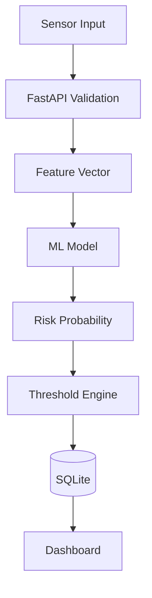

# Project Flow

```mermaid
flowchart TD
A[Sensor Input] --> B[FastAPI Validation]
B --> C[Feature Vector]
C --> D[ML Model]
D --> E[Risk Probability]
E --> F[Threshold Engine]
F --> G[(SQLite)]
G --> H[Dashboard]
```
