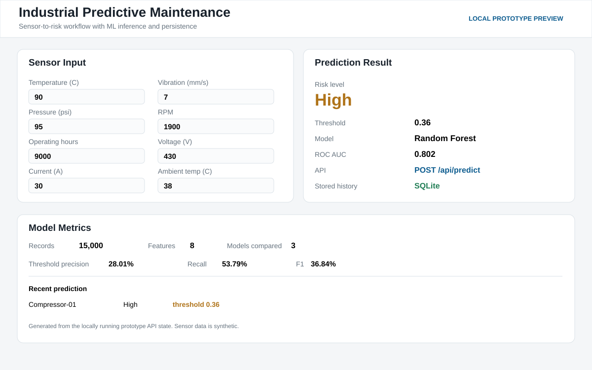

# Predictive Maintenance for Industrial Equipment

Full local engineering prototype for predicting equipment failure risk from operational sensor readings.



## Included
- Reproducible synthetic data generation
- Model comparison and threshold tuning
- FastAPI prediction API
- SQLite prediction history
- Browser dashboard
- PRD, TRD, project flow, UI UX design, backend schema and implementation plan

## Measured result
- 15000 simulated sensor records
- 8 operational features
- 3 ML models compared
- Best ROC AUC: 0.802
- Threshold 0.36: 28.01 percent precision, 53.79 percent recall, 36.84 percent F1

## Run
```bash
pip install -r requirements.txt
python src/train_model.py
uvicorn src.main:app --reload --port 8002
```

Open http://127.0.0.1:8002

Note: the dataset is synthetic or simulated.
